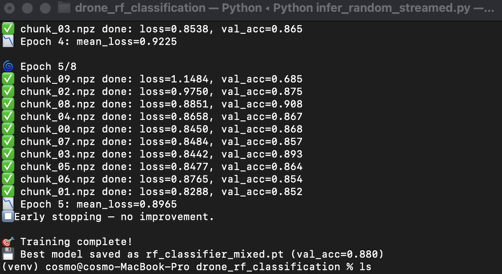
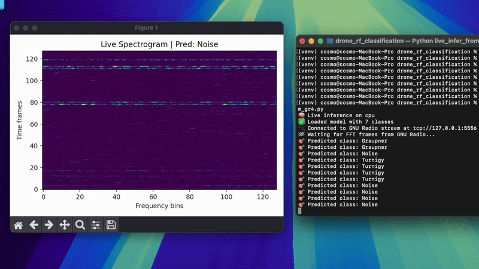

# Radio Frequency Drone Classification
End-to-End Radio Frequency Drone Classification:

- Train on a kaggle dataset.
- Create random samples to be live streamed in a tcp server.
- Listen to the tcp server and inference the trained model into it.

## Create virtual environment and install dependencies

Execute setup_virtual_environment.py

## Dataset

Download the Dataset from https://www.kaggle.com/datasets/sgluege/noisy-drone-rf-signal-classification

## Dataset preprocessing

Since I am using a macbook pro with M1 16GB I splitted the dataset into manageable randomized chunks with split_dataset_into_chunks.py

## Train

Execute train.py

## Create samples to be streamed for GNU Radio

Execute export_iq_for_gnuradio.py to create 1000 samples that will be played by GNU Radio

## Start stream in GNU Radio

Load the file stream_data.grc within GNU Radio and choose the file source that will be created by export_iq_for_gnuradio.py
Adapt the ports if necessary

## Inference
Execute live_inference_from_gnuradio.py 
Adapt the ports if necessary

